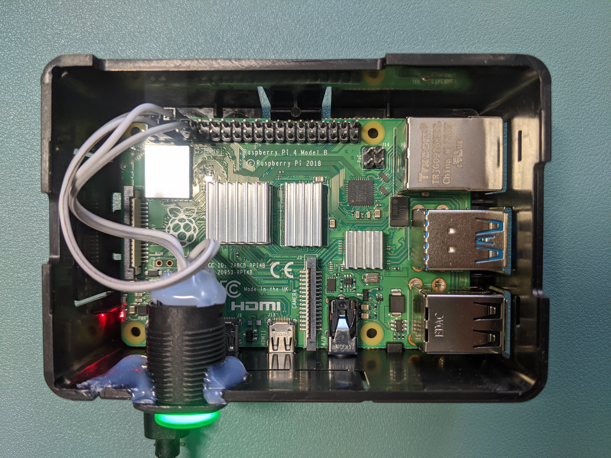

# rpi-setup
Ansible playbook for my Raspberry Pi



## Where to start
Check out my other [macos-setup repo](https://github.com/giahuy2201/macos-setup) to learn how to install Ansible.

To start the automation
```
ansible-playbook run.yml -K
```